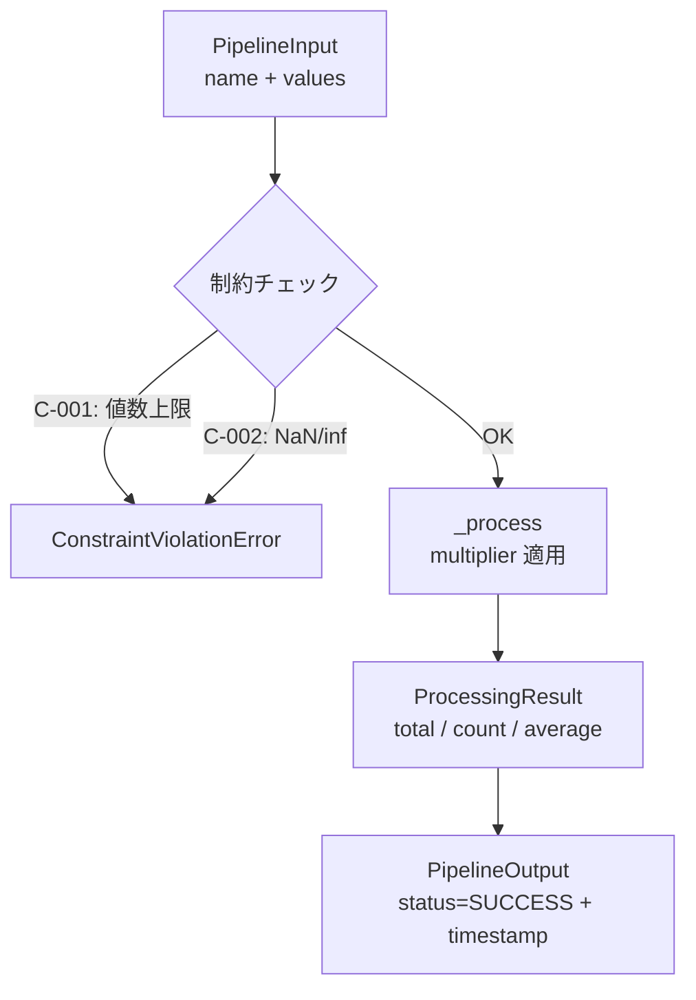

# アーキテクチャ（Architecture）

## 目的

責務境界を明確にし、実装・テスト・監査を容易にする。

## モジュール責務

```text
src/my_package/
├─ core/          型定義、例外、設定管理（最下層・依存ゼロ）
│   ├─ types.py       Status, PipelineInput, ProcessingResult, PipelineOutput
│   ├─ exceptions.py  DomainError 階層（ValidationError, ConfigError, ConstraintViolationError）
│   └─ config.py      PipelineConfig, load_config()（TOML ローダー）
├─ domain/        ドメインロジック（制約チェック、パイプライン処理）
│   ├─ constraints.py  check_constraints()（C-001: 最大値数, C-002: NaN/inf 禁止）
│   └─ pipeline.py     Pipeline クラス（入力→制約→処理→出力）
```

テンプレート共通モジュール（`src/` 直下）:

```text
src/
├─ observability/  OpenTelemetry 計装（オプショナル。OTel SDK 未インストール時は no-op）
├─ sample/         Design by Contract のサンプル実装（テンプレート参考用）

web/
├─ src/
│  ├─ App.jsx       MiraStudy 画面実装（プロファイル選択、学年判定、ホーム遷移）
│  ├─ App.test.js   学年判定ロジックの単体テスト（Vitest）
│  ├─ repositories/
│  │  ├─ firestorePaths.js
│  │  │               Firestore パス定義の一元管理
│  │  ├─ firestoreGateway.js
│  │  │               Firestore SDK 境界（read/write/update interface + retry）
│  │  ├─ retryHelper.js
│  │  │               指数バックオフ付きリトライユーティリティ
│  │  ├─ miraFirestoreRepository.js
│  │  │               Gateway 注入型 repository（profiles / learningArchive / masterSources）
│  │  ├─ miraRepositoryFactory.js
│  │  │               環境変数 VITE_FIRESTORE_MODE によるスタブ/realtime 切替 factory
│  │  ├─ miraFirestoreRepository.test.js
│  │  │               repository とパス解決の単体テスト
│  │  ├─ retryHelper.test.js
│  │  │               リトライ振る舞いの単体テスト
│  │  └─ miraRepositoryFactory.test.js
│  │                  切替 factory と SDK アダプタ分岐の単体テスト
│  ├─ main.jsx      エントリポイント
│  └─ index.css     Tailwind v4 + カスタムスタイル
├─ package.json     React / Vite / Tailwind / Vitest 依存
└─ vite.config.js   Vite 設定（React plugin / test 設定）
```

<!-- project-config.yml の modules に合わせてモジュールを追加する -->

### core/

- **types.py** — ドメイン型定義。すべて frozen dataclass で不変条件を `__post_init__` で検証（Design by Contract）
  - `Status`: パイプラインの実行状態（PENDING / RUNNING / SUCCESS / FAILED）
  - `PipelineInput`: 入力データ（name は空不可、values は1要素以上）
  - `ProcessingResult`: 処理結果（total ≥ 0、count > 0、average = total/count）
  - `PipelineOutput`: 出力データ（status は SUCCESS か FAILED、UTC タイムスタンプ付き）
- **exceptions.py** — ドメイン例外階層
  - `DomainError` → `ValidationError` / `ConfigError` / `ConstraintViolationError`
  - `ConstraintViolationError`: 制約 ID と詳細を保持し、フェイルクローズ（P-010）を実現
- **config.py** — TOML 設定読み込み
  - `PipelineConfig`: max_values（正の整数）、multiplier（正の実数）、output_dir
  - `load_config()`: TOML ファイルを読み込み PipelineConfig を返す（不正値は ConfigError）

### domain/

- **constraints.py** — 入力制約の検証
  - `check_constraints()`: C-001（値数上限）、C-002（NaN/inf 禁止）を評価
  - 違反時は `ConstraintViolationError` を送出（フェイルクローズ）
- **pipeline.py** — MVP パイプライン
  - `Pipeline.run()`: 入力→制約チェック→処理→出力の一連フローを実行

### web/src/

- **App.jsx** — MiraStudy フロントエンドの初期実装
  - `calculateCurrentAge()`: 誕生日未到来を考慮した年齢計算
  - `calculateSchoolStageAndGrade()`: 4/2〜翌4/1同学年ルールによる学年判定
  - `ProfileSelector`: 起動時の3プロファイル選択画面
  - `StudentHome` / `ParentHome`: repository 層経由のデータ取得とホーム復帰導線
  - repository 生成は `createMiraRepositoryFromEnv()` factory 経由（スタブ/realtime 切替可能）
- **repositories/firestorePaths.js** — Firestore コレクションパスの正本
  - `/artifacts/{appId}/public/data/masterSources`
  - `/artifacts/{appId}/users/{userId}/learningArchive`
  - `/artifacts/{appId}/users/{userId}/profiles`
- **repositories/firestoreGateway.js** — Firestore SDK 境界
  - `readDocument(path)` / `writeDocument(path, value)` / `updateDocument(path, updater)`: Gateway interface 契約
  - `assertFirestoreGateway()`: 契約検証（不一致時 `E_REPOSITORY_CONTRACT_INVALID`）
  - `createInMemoryFirestoreGateway(...)`: スタブ実装（リトライなし）
  - `createFirestoreSdkGateway({ readDocument, writeDocument, updateDocument, retryOptions })`: SDK 関数群を受け取り retry ラッパーを被せて返す Adapter
- **repositories/retryHelper.js** — 指数バックオフ付きリトライ
  - `withRetry(fn, options)`: `maxRetries`・`baseDelayMs`・`maxDelayMs` を設定可能
  - `DEFAULT_RETRY_OPTIONS`: `{ maxRetries: 3, baseDelayMs: 300, maxDelayMs: 5000 }`
- **repositories/miraRepositoryFactory.js** — Repository 生成 factory（切替の単一制御点）
  - `createMiraRepositoryFromEnv({ mode, sdkFunctions, appId, latencyMs, retryOptions })`
  - `mode="realtime"` かつ `sdkFunctions` が注入されている場合は SDK gateway を構築
  - それ以外はスタブにフォールバック
  - `mode` 省略時は環境変数 `VITE_FIRESTORE_MODE` を参照（未設定は "stub"）
- **repositories/miraFirestoreRepository.js** — Firestore 連携 repository
  - `fetchProfiles()`: プロファイル取得
  - `fetchLearningArchive()`: 学習アーカイブ取得（失敗ケース含む）
  - `fetchMasterSources()` / `toggleMasterSource()`: 保護者ソース管理
  - `resolvePaths()`: 画面表示用のパス解決
  - `gateway` 注入により SDK 実装へ差し替え可能
- **App.test.js / repositories/*.test.js** — 学年判定・検証ロジック・repository 振る舞いの単体検証

## データフロー



### CLI 実行フロー

```text
scripts/run_pipeline.py --config configs/pipeline_default.toml
       │
       ▼
  load_config() → PipelineConfig
       │
       ▼
  Pipeline(config).run(input_data) → PipelineOutput
       │
       ▼
  exit code 0 (SUCCESS) / 1 (エラー)
```

## 依存ルール

- `core`: 依存してよい -> （なし：最下層）、依存禁止 -> 他の全モジュール
- `domain`: 依存してよい -> `core`、依存禁止 -> `observability`, `sample`
- `observability`: 依存してよい -> （外部: OTel SDK）、依存禁止 -> `core`, `domain`
- `sample`: 依存してよい -> （なし）、依存禁止 -> `core`, `domain`

<!-- 必要に応じて追加 -->

## 制約仕様（N-002）

- `C-001` 最大入力値数: `len(values) <= max_values`、違反時は `ConstraintViolationError`
- `C-002` 値範囲チェック: `values` に NaN/inf を許容しない、違反時は `ConstraintViolationError`

## 不変条件

- 禁止操作を実装しない（P-001）
- 判断不能時は安全側に倒す（P-010: フェイルクローズ）
- 制約は常に優先され、ドメインロジックが回避できない

## 設計論点（必要に応じて ADR）

- **Design by Contract**: すべてのドメイン型は frozen dataclass + `__post_init__` による不変条件検証を採用（N-002）
- **フェイルクローズ（P-010）**: 制約違反時は `ConstraintViolationError` を送出し、処理を中断する
- **設定の外部化**: アプリケーション設定は TOML ファイルで管理し、コードに埋め込まない
